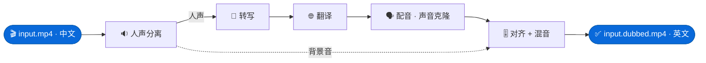

# video-dub

[English](README.md) · **简体中文**

[](https://www.python.org/)
[](https://pytorch.org/)
[](https://docs.astral.sh/uv/)
[](https://docs.astral.sh/ruff/)
[](LICENSE)
[](PLAN.md)

**把视频从一种语言转换成另一种语言 —— 同时保留原说话人的声音。**

`video-dub` 是一个以本地运行为主、模块化的视频本地化工具。给它一个中文视频，它能
返还一个英文配音版本，而且听起来*仍然像同一个人在说话* —— 如果你只需要字幕，它也
可以只生成一个英文字幕文件。

主要使用场景：**中文视频 → 英文配音。** 其它语言组合同样适用。



---

## 目录

- [演示](#演示)
- [功能介绍](#功能介绍)
- [环境要求](#环境要求)
- [安装指南](#安装指南)
- [快速上手](#快速上手)
  - [示例 A 中文视频转英文配音](#示例-a-中文视频转英文配音)
  - [示例 B 为中文视频生成英文字幕](#示例-b-为中文视频生成英文字幕)
  - [示例 C 用其它模型处理日文视频](#示例-c-用其它模型处理日文视频)
  - [无需 GPU 与 API Key 的体验方式](#无需-gpu-与-api-key-的体验方式)
- [命令参考](#命令参考)
- [配置说明](#配置说明)
- [工作原理与设计](#工作原理与设计)

---

## 演示

由 `video-dub` 将中文片段配音为英文。英文译文以**原说话人声音的克隆**朗读，背景音
保持不变 —— 只替换其中的人声。

<table>
<tr>
<th width="50%">▶️ 原视频 · 中文</th>
<th width="50%">▶️ 配音版 · 英文</th>
</tr>
<tr>
<td>

https://github.com/user-attachments/assets/fc6ce533-74b5-4de4-b7cc-c14b037d1995

</td>
<td>

https://github.com/user-attachments/assets/d625c097-244b-48ce-8740-e084e8cf44c6

</td>
</tr>
<tr>
<td>

https://github.com/user-attachments/assets/045c28dc-bb8f-45be-986e-ea95f8af5588

</td>
<td>

https://github.com/user-attachments/assets/8c990239-d686-486a-a891-14fad8c627d6

</td>
</tr>
</table>

> 视频文件存放在 [`samples/`](samples/) 目录中，并已纳入 git 跟踪。

---

## 功能介绍

`video-dub` 围绕一条**流水线（pipeline）**构建：整个工作被拆分成多个相互独立的
*阶段（stage）*，每个阶段把一份干净、带类型的结果交给下一个阶段。你不需要手动逐个
运行这些阶段 —— 你只需选择一个**配方（recipe）**（一组预先编排好的阶段序列），工具
就会替你依次执行。

下面是本文档中反复出现的几个术语，用通俗的话解释：

| 术语 | 含义 |
|------|------|
| **ASR**（自动语音识别） | 听音频并把其中的话写成文字 —— 也就是“转写”。 |
| **TTS**（文本转语音） | 相反的过程：把文字变成朗读出来的音频。 |
| **人声分离**（Source separation） | 把一条音轨拆成*人声*（说话声）和*背景*（音乐、音效），从而让背景能原封不动地保留。 |
| **声音克隆**（Voice cloning） | 给 TTS 一段某人说话的短样本，让合成出来的声音听起来像那个人。 |
| **说话人分离**（Diarization） | 当有多个说话人时，标注每句话*是谁*说的。 |
| **后端**（Backend） | 某个阶段的一种具体实现。每个阶段都有多个可互换的后端 —— 一个真实后端（例如神经网络），以及一个 `mock` 后端（快速、假的，用于测试）。 |
| **配方**（Recipe） | 一组有名字的阶段序列。你选定一个配方，工具就会执行其中的阶段。 |

你最常用到的三个配方：

| 配方 | 命令快捷方式 | 输出 |
|------|--------------|------|
| `full_dub` | `videodub dub` | 一个用目标语言配音的新视频文件 —— 外加一个同名 `.srt` 字幕文件。 |
| `translate_subtitles` | `videodub subtitle` | 一个翻译后的字幕文件（`.srt`）。 |
| `transcribe` | `videodub transcribe` | 一个*原始*语言的字幕文件（不翻译）。 |

此外还有 `refine_subtitles`（`videodub refine`），它会校对一个已有的字幕文件，
修正其中的语音识别错误。

---

## 环境要求

- **Python 3.12** —— 必须正好是 3.12（不是 3.11，也不是 3.13）。
- **[`uv`](https://docs.astral.sh/uv/)** —— 本项目使用的包管理器。
- **`ffmpeg`**（含 `ffprobe`）—— 需在 `PATH` 中，用于读写视频/音频。
- **`rubberband`** 命令行工具 —— 用于拉伸合成语音使其保持同步。仅**完整配音**
  配方需要。
- **一块支持 CUDA 的 NVIDIA 显卡** —— 真实的语音识别、人声分离和文本转语音模型
  需要它。（如果你没有显卡，见[无需 GPU 与 API Key 的体验方式](#无需-gpu-与-api-key-的体验方式)。）
- **一个 [DeepSeek](https://platform.deepseek.com/) API Key** —— 用于翻译阶段。
  这是一个付费云端 API；翻译是唯一一个*并非完全本地*的阶段。

---

## 安装指南

以下步骤假设你在一台装有 NVIDIA 显卡的全新机器上操作。

**1. 安装 `uv`**（包管理器）：

```bash
curl -LsSf https://astral.sh/uv/install.sh | sh
```

**2. 安装系统工具**（`ffmpeg` 和 `rubberband`）。在 Debian/Ubuntu 上：

```bash
sudo apt update
sudo apt install -y ffmpeg rubberband-cli
```

**3. 获取代码并安装 Python 依赖：**

```bash
git clone https://github.com/YQinGIT/video-dub.git
cd video-dub

uv sync --extra gpu     # 安装全部依赖，包括 CUDA 模型栈
```

> `uv sync`（不带 `--extra gpu`）只安装轻量、可移植的部分。如果你只想试试
> [无需 GPU 的 mock 路径](#无需-gpu-与-api-key-的体验方式)，用这个即可。

**4. 填入你的 DeepSeek API Key。** 复制示例环境文件并填写：

```bash
cp .env.example .env
```

然后编辑 `.env`，使其内容为：

```dotenv
VIDEODUB_DEEPSEEK_API_KEY=sk-your-real-key-here
```

`.env` 文件已被 git 忽略，因此你的 Key 不会进入版本控制。

**5.（仅完整配音需要）安装文本转语音模型。** 配音的声音由 **IndexTTS-2** 生成，
它需要自己独立的 Python 环境。请按照
[`src/videodub/tts/indextts2.py`](src/videodub/tts/indextts2.py) 模块文档字符串
中的说明进行安装。如果你只需要字幕，可以跳过这一步。

**6. 验证是否能正常工作：**

```bash
uv run pytest          # 运行测试套件 —— 无需 GPU
uv run videodub recipes  # 列出所有可用配方
```

> **运行命令的方式：** 下文每条命令都写成 `uv run videodub ...`。`uv run` 前缀
> 确保命令在项目环境内运行。如果你想直接输入 `videodub`，请先用
> `source .venv/bin/activate` 激活环境。

---

## 快速上手

### 示例 A 中文视频转英文配音

这会产出一个全新的、用英文朗读、并保留原说话人声音的视频。中文转英文是**默认**
方向，因此无需任何配置：

```bash
uv run videodub dub my_video.mp4
```

输出：在输入文件旁边生成 **`my_video.dubbed.mp4`**，并附带一个同名字幕文件
**`my_video.dubbed.srt`**。两者同名，所以大多数播放器在打开配音视频时会自动
加载字幕。

针对中文语音，我们建议加上项目内置的
[`recipes/zh_dub.toml`](recipes/zh_dub.toml) 配置。它会换用 **FunASR** —— 一个
几乎完全用普通话训练的转写模型，在中文音频上明显比通用的默认模型更准确：

```bash
uv run videodub dub my_video.mp4 --config recipes/zh_dub.toml
```

> **这一步需要：** 一块 GPU、IndexTTS-2 语音模型（上面第 5 步）、`rubberband`，
> 以及一个 DeepSeek API Key。

### 示例 B 为中文视频生成英文字幕

如果你只想要字幕 —— 不要新音频、不要新视频 —— 请用 `subtitle` 命令。它会转写
中文语音、翻译成英文，并写出一个字幕文件：

```bash
uv run videodub subtitle my_video.mp4
```

输出：在输入文件旁边生成 **`my_video.translated.srt`**。

这比完整配音轻量得多：它**不需要** TTS 语音模型，也**不需要** `rubberband`。但它
仍然需要 GPU（用于转写）和 DeepSeek API Key（用于翻译）。和示例 A 一样，可加上
`--config recipes/zh_dub.toml` 以使用更准确的中文转写模型：

```bash
uv run videodub subtitle my_video.mp4 --config recipes/zh_dub.toml
```

如需自行指定输出文件名：

```bash
uv run videodub subtitle my_video.mp4 --output english_subs.srt
```

### 示例 C 用其它模型处理日文视频

默认的转写模型是为中文调优的。对于**日文**视频，我们需要：(1) 选一个能很好处理
日文的转写模型；(2) 告诉翻译器源语言现在是日文而不是中文。

这两处改动都写在一个小配置文件里。新建一个名为 `ja_subtitle.toml` 的文件：

```toml
# 日文视频 -> 英文字幕。

[asr]
backend  = "whisperx"   # 换一个模型：多语言，且词级时间戳准确
language = "ja"         # 告诉它音频是日文

[translation]
source_language = "ja"  # 从日文翻译……
target_language = "en"  # ……翻译成英文
```

然后运行 `subtitle` 命令，用 `--config` 指向该文件：

```bash
uv run videodub subtitle japanese_video.mp4 --config ja_subtitle.toml
```

输出：**`japanese_video.translated.srt`**。

可用的转写后端有 `faster_whisper`（默认）、`whisperx`（Whisper 加上更准确的词级
时间戳 —— 此处推荐）、`funasr`（仅中文）以及 `mock`。如果你想做完整的日译英配音，
同一个 `ja_subtitle.toml` 文件也可用于 `dub` 命令。

### 无需 GPU 与 API Key 的体验方式

每个阶段都自带一个 **mock** 后端 —— 一个快速、假的替身，产出占位结果。内置的
[`recipes/mock.toml`](recipes/mock.toml) 会把所有阶段都选为 mock 后端，因此整条
流水线可以在任何笔记本上运行：

```bash
uv sync                                                   # 仅核心安装，不含 GPU 栈
uv run videodub dub my_video.mp4 --config recipes/mock.toml
```

结果不会是真正的配音，但它能证明你的安装从头到尾可用。自动化测试也是这样运行的。

---

## 命令参考

安装后的命令是 **`videodub`**。它有一个通用命令 `run`，外加四个常用配方的快捷
方式。

```bash
videodub run <recipe> <input> [options]   # 按名称运行任意配方
videodub recipes                          # 列出所有配方及其阶段

videodub dub        <video>      # 等价于：run full_dub
videodub subtitle   <video>      # 等价于：run translate_subtitles
videodub transcribe <video>      # 等价于：run transcribe
videodub refine     <subtitle>   # 等价于：run refine_subtitles
```

**选项**（上述每条命令都接受）：

| 选项 | 简写 | 说明 |
|------|------|------|
| `--config <file>` | `-c` | 一个用于选择后端和设置的 `.toml` 或 `.json` 文件。 |
| `--output <path>` | `-o` | 结果写入的位置。默认写到输入文件旁边。 |

**各配方及其默认输出名：**

| 配方 | 阶段 | 默认输出 |
|------|------|----------|
| `full_dub` | 提取 → 分离 → 转写 → 校对 → 翻译 → 合成 → 对齐 → 混音 → 封装 → 生成字幕 | `<name>.dubbed.mp4` + `<name>.dubbed.srt` |
| `translate_subtitles` | 提取 → 转写 → 校对 → 翻译 → 生成字幕 | `<name>.translated.srt` |
| `transcribe` | 提取 → 转写 → 生成字幕 | `<name>.srt` |
| `refine_subtitles` | 载入字幕 → 校对 → 生成字幕 | 覆盖输入文件 |

`videodub refine` 接受的是一个**字幕文件**（`.srt` 或 `.vtt`），而不是视频。它把
文本发给 DeepSeek 修正语音识别错误，再把清理后的文件写回 —— 适合批量润色字幕，
而无需重新运行整条流水线。

---

## 配置说明

你几乎从不需要改代码。你只需通过配置，把工具指向不同的**后端**和**设置**。设置按
以下顺序解析，上层覆盖下层：

1. 一个 `--config` 文件（TOML 或 JSON），如果你传了的话。
2. 带 `VIDEODUB_` 前缀的环境变量。
3. 当前目录下的 `.env` 文件（你的 API Key 就放在这里）。
4. 内置默认值。

一个配置文件中，每个阶段对应一个 `[section]`。你只需列出想改的项 —— 其余都保持
默认。一个更完整的示例：

```toml
[asr]
backend  = "whisperx"   # faster_whisper | whisperx | funasr | mock
language = "ja"         # null = 自动检测

[translation]
backend         = "deepseek"   # deepseek | mock
source_language = "ja"
target_language = "en"

[separation]
backend = "demucs"      # demucs | mock
enabled = true          # 设为 false 可跳过人声/背景分离

[tts]
backend      = "indextts2"   # indextts2 | mock
trim_silence = true          # 在对齐前剪掉每段音频中的空白

[timing]
backend = "rubberband"  # rubberband | mock
```

同样的值也可以改用环境变量来设置。嵌套设置使用双下划线（`__`）：

```bash
export VIDEODUB_ASR__BACKEND=whisperx
export VIDEODUB_TRANSLATION__SOURCE_LANGUAGE=ja
```

**机密信息** —— 你的 DeepSeek API Key —— 只从环境变量或 `.env` 读取，绝不从
`--config` 文件读取：

```dotenv
VIDEODUB_DEEPSEEK_API_KEY=sk-...
```

---

## 工作原理与设计

`video-dub` 被设计成**一条由独立阶段组成的流水线**。其指导思想如下：

- **一个阶段，一项职责。** 每个阶段只做一件定义明确的转换，并且是一个自包含的
  Python 模块。
- **阶段之间是带类型的契约。** 各阶段通过 [Pydantic](https://docs.pydantic.dev/)
  数据对象（`Transcript`、`Segment`、`SeparatedAudio`、`SynthesizedAudio`）通信。
  一个阶段并不关心上一个阶段*如何*完成工作 —— 只关心数据符合契约。正是这一点让
  后端可以互换。
- **配方只是数据。** 一个配方就是一串有序的阶段名。新增一种工作流意味着新增一个
  列表，而不是编写编排代码。
- **后端可替换，由配置选定。** 每个阶段都提供一个真实后端和一个 `mock` 后端。一个
  工厂函数按你配置中指定的名字选择后端，并*延迟导入*它 —— 因此仅仅导入本项目绝不
  会加载笨重的 GPU 库，除非你真的用到。在 mock 与真实之间切换只需改一行配置，从不
  需要改代码。
- **本地优先。** 除翻译会调用 DeepSeek 云端 API 外，其它一切都在你自己的机器上
  运行。

### 各阶段与所用模型

| 阶段 | 作用 | 所用模型 / 工具 | 运行于 |
|------|------|------------------|--------|
| **媒体 I/O** | 从视频中提取音频；之后再把新音频放回去。 | `ffmpeg` | CPU |
| **人声分离** | 把音轨拆成*人声*和*背景*，使音乐和音效得以保留进配音中。 | **Demucs**（`htdemucs_ft`） | GPU |
| **ASR（转写）** | 把语音转成带时间戳的文字。 | **faster-whisper**（`large-v3`，默认）、**WhisperX**（词级时间更准）或 **FunASR**（`Paraformer-zh`，普通话专长） | GPU |
| **校对（Refine）** | 可选地校对转写文本，在翻译前修正识别错误。 | **DeepSeek**（`deepseek-chat`） | 云端 API |
| **翻译** | 翻译每个片段，并保留原有时间戳。它是*时长感知*的 —— 提示词会告诉模型每句话有多长时间，使译文能贴合可用时长。 | **DeepSeek**（`deepseek-chat`） | 云端 API |
| **TTS（语音合成）** | 朗读译文，并从分离出的人声中*克隆原说话人的声音*，然后剪掉每段音频里的空白（开头静音、模型自行加入的停顿），使对齐阶段很少需要裁切语音。 | **IndexTTS-2**（零样本、跨语言声音克隆） | GPU |
| **对齐（Timing）** | 拉伸或压缩每段合成音频，使其对齐到原始时间线，且听起来不别扭。 | **Rubberband** | CPU |
| **字幕** | 把 `Transcript` 渲染成 `.srt` / `.vtt` / `.ass`（或反向解析）。 | 内置 | CPU |
| **混音** | 把配音人声与保留下来的背景音乐合在一起。 | `ffmpeg`（`amix`） | CPU |

**完整配音**会运行整条链路，并在最后于配音视频旁写出一个字幕文件 —— 因此配音始终
附带匹配的字幕。**字幕**或**转写**任务只用到左半部分 —— 提取、转写、（翻译、）
渲染 —— 这就是这些配方不需要吃 GPU 的 TTS、也不需要 `rubberband` 的原因。

### 项目结构

```
src/videodub/
  schemas.py      阶段之间共享的数据契约
  config.py       所有设置（Pydantic）
  media_io/       音频提取、重新封装（ffmpeg）
  separation/     人声与背景分离（demucs | mock）
  asr/            语音 -> 文字（faster_whisper | whisperx | funasr | mock）
  translation/    文字 -> 译文（deepseek | mock）
  tts/            文字 -> 语音（indextts2 | mock）
  timing/         将语音对齐到时间线（rubberband | mock）
  subtitle/       渲染 / 解析字幕
  mixing/         人声 + 背景混音
  pipeline/       配方，以及执行它们的运行器
  cli/            `videodub` 命令
recipes/          现成的配置文件（mock.toml、zh_dub.toml）
tests/            测试套件（无需 GPU 即可运行）
```

---

## 项目状态

正在按阶段持续开发中。完整的构建计划与进度追踪见 **[PLAN.md](PLAN.md)**。
